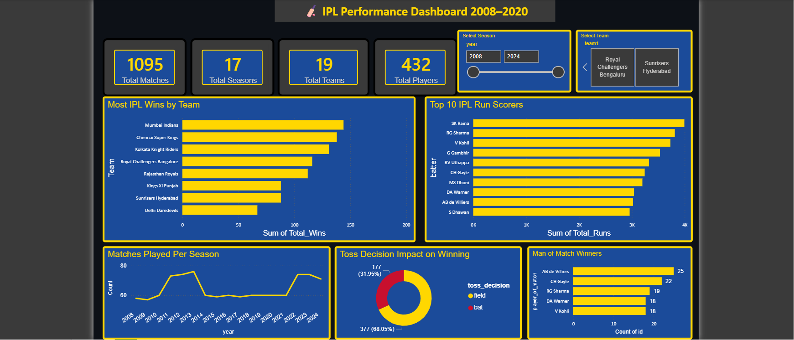

# 🏏 IPL Performance Dashboard 2008–2020

## Dashboard Preview

## Project Overview
Interactive IPL Performance Dashboard analyzing 
1,095 matches across 17 seasons from 2008 to 2020. 
Built using Python for data cleaning and Power BI 
for interactive visualization with full IPL theme.

## Tools Used
- Python (Pandas) — data cleaning and preparation
- Power BI — interactive dashboard and visualization

## Key Insights Found
- Mumbai Indians are the most successful IPL team
  with 140+ wins across all seasons
- SK Raina is the all time highest run scorer 
  with 4000+ runs in IPL history
- Teams choosing to field first win 68.05% of 
  matches after winning toss
- AB de Villiers won Man of Match award 25 times —
  most in IPL history
- IPL matches per season grew from 58 in 2008 
  to 74+ in recent seasons

## Dashboard Visuals
- 4 KPI cards — Total Matches, Seasons, Teams, Players
- Bar chart — Most IPL wins by team
- Bar chart — Top 10 all time run scorers
- Line chart — Matches played per season trend
- Donut chart — Toss decision impact on winning
- Bar chart — Top 5 Man of Match winners
- Season slicer — filter by year
- Team slicer — filter by team

## Dataset
- Source: IPL Complete Dataset (Kaggle)
- Matches: 1,095
- Seasons: 2008–2020
- Teams: 19
- Players: 432

## Author
Harshitha Guntha
B.Tech CSE — Artificial Intelligence
SVR Engineering College
GitHub: github.com/Harshi3135
